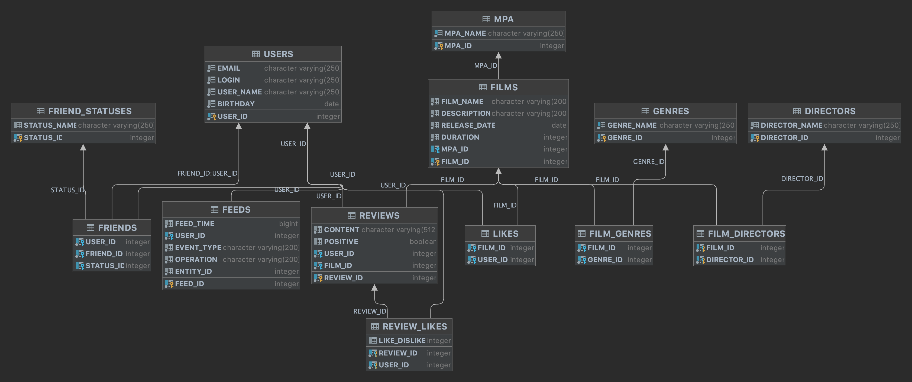

# java-filmorate

Бэкенд для сервиса, который будет работать с фильмами и оценками пользователей, а также возвращать топ-5 фильмов, рекомендованных к просмотру, осуществлять поиск по жанру, режиссёру.
Так же существует возможнасть выделять любимые фильмы, получать рекомендации и многое другое.

Сервис написан на Java 11, на основе Spring Boot. Реализует REST API. В работе использованы Lombok, JUnit тестирование, Docker. 

####Схема базы данных:


 
USERS
- user_id — идентификатор пользователя (первичный ключ);
- email электронная почта;
- login логин пользователя;
- name имя пользователя;
- birthday дата рождения;

FRIENDS 
- user_id идентификатор пользователя (ссылается на таблицу USERS);
- friend_id идентификатор друга (соответствует user_id в таблице USERS);
- status_id идентификатор статуса (ссылается на таблицу FRIENDSHIP_STATUS);
}

FRIENDSHIP_STATUS 
- status_id идентификатор статуса (первичный ключ);
- name наименование статуса;
 
FILMS 
- film_id идентификатор фильма (первичный ключ);
- name наименование фильма;
- description описание фильма;
- release_date дата релиза;
- duration описание фильма;
- rating_id рейтинг Ассоциации кинокомпаний (внешний ключ. Ссылается на таблицу RATINGS);

LIKES 
- film_id идентификатор фильма (ссылается на таблицу FILMS);
- user_id идентификатор пользователя (ссылается на таблицу USERS);

GENRES 
- genre_id идентификатор жанра (первичный ключ);
- name наименование жанра;

FILM_GENRE {
- film_id идентификатор фильма (ссылается на таблицу FILMS);
- genre_id идентификатор жанра (ссылается на таблицу GENRES);

RATINGS 
- rating_id идентификатор рейтинга (первичный ключ);
- name наименование рейтинга;

Для того чтобы создать таблицу USERS нужно выполнить запрос:
```
create table USERS
(
    USER_ID  INTEGER auto_increment,
    EMAIL    CHARACTER VARYING(250) not null,
    LOGIN    CHARACTER VARYING(250) not null,
    USER_NAME     CHARACTER VARYING(250) not null,
    BIRTHDAY DATE                   not null,
    constraint """USERS""_PK"
        primary key (USER_ID)
);
```

Для записи данных в таблицу нужно выполнить запрос:
```

INSERT INTO FRIEND_STATUSES(STATUS_ID, STATUS_NAME)
values (1, 'неподтверждённая'),
       (2, 'подтверждённая');
```


Для того чтобы получить список всех друзей нужно выполнить запрос:
```
SELECT u.*
FROM friends f
JOIN users u ON u.user_id = f.friend_id
WHERE f.user_id = 1
```
### Запуск:
Склонируйте репозиторий: git clone https://github.com/AnastasiaKuznetsova2806/java-filmorate.git
Запуск осуществляется с использованием IntelliJ IDEA:

java-filmorate/src/main/java/ru/yandex/practicum/filmorate/FilmorateApplication -> "run"